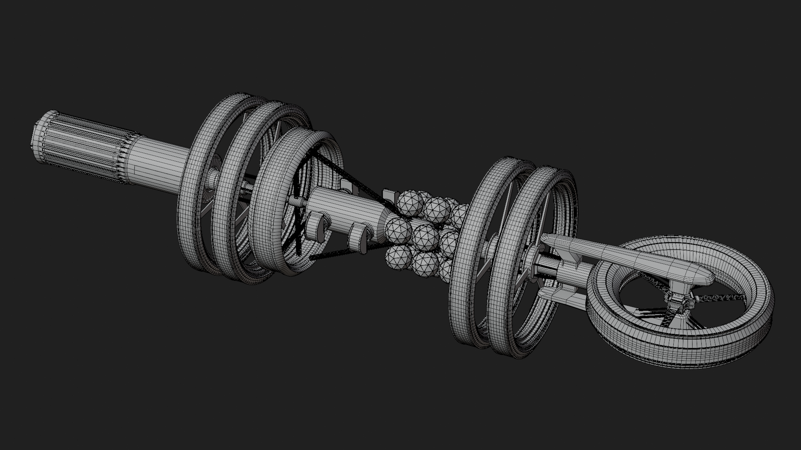
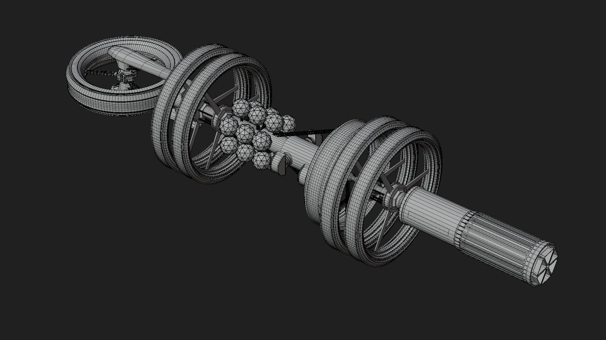

# PROGRAMME ERIZON — 3D MODELS

## Overview

<table>
<tr>
<td></td>
<td></td>
</tr>
</table>

**Programme ERIZON** is an original space project featuring a fictional **nuclear-powered spacecraft** and a detailed 3D model of Earth.

The entire spacecraft, Earth model, scene, materials, and presentation were created by me in Blender, with NASA Earth imagery used for the Earth textures.

<table>
<tr>
<td></td>
<td></td>
</tr>
</table>

## Modeling & Scene

* **Spacecraft:** Designed and modeled the spacecraft from scratch, including its main structure, engines, mechanical details, and surface components.
* **Earth:** Created a detailed 3D Earth model and applied high-resolution Earth textures based on NASA imagery.
* **Materials:** Created the materials and surface details for both the spacecraft and Earth.
* **Scene:** Built and arranged the space environment and supporting scene elements.
* **Compositing:** Used compositing and additional visual effects to improve the final presentation.
* **Optimization:** Refined the scene and assets to keep the project manageable while maintaining visual detail.

All major modeling, scene construction, materials, and visual work were created by me.

## Demos

<table>
  <tr>
    <td></td>
    <td></td>
  </tr>
</table>

**Spacecraft & Earth:** [View the 3D MODELS on Sketchfab](SKETCHFAB_LINK)

## License

This project is licensed under **CC BY-NC 4.0**.

You may share and adapt this project for **non-commercial purposes**, with appropriate credit to **Binupa**.

**Commercial use is not permitted without permission.**

Full license: [Creative Commons — CC BY-NC 4.0](https://creativecommons.org/licenses/by-nc/4.0/)

## Project Info

* **Software:** Blender
* **Project Type:** 3D Space / Science-Fiction
* **Models:** Original Spacecraft + Earth
* **Focus:** Modeling, Texturing, Environment & Compositing
* **Earth Textures:** NASA imagery
* **Time Spent:** ~35+ hours
* **Status:** Completed
